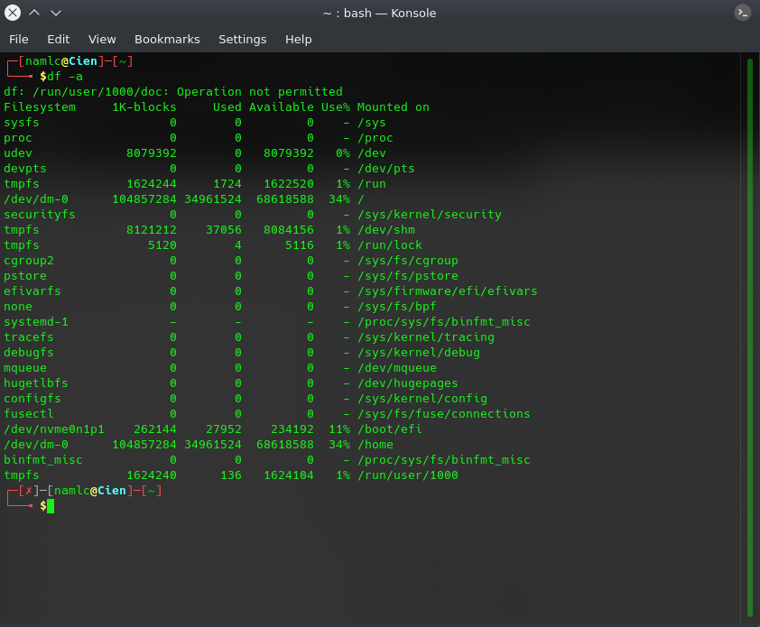
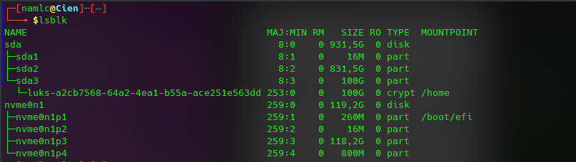
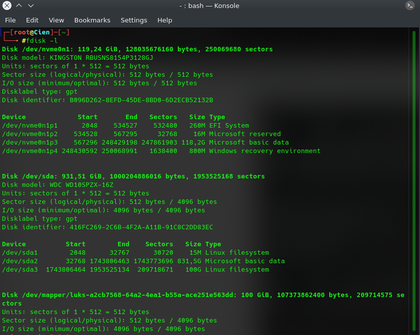

# **Report Vietnix Linux Basic**


#           PART 01: 
1. <a href='#1'> Check Diskpace
1. <a href='#2'> Check Partitions
1. <a href='#3'> Check cpu, ram, network
1. <a href='#4'> Process Monitor
1. <a href='#5'> List files/ directories
1. <a href='#6'> Find, copy, move,... files/directories
1. <a href='#7'> Basic and advanced decentralization
1. <a href='#8'> Editors command
1. <a href='#9'> Mount/ Unmount
1. <a href='#10'> Symbolic Links
1. <a href='#11'> Hard Links
1. <a href='#12'> Compressed/ Depressed
1. <a href='#13'> Bandwidth monitoring
1. <a href='#14'> nmap, telnet, ping, ssh, transfer files from local to public host
1. <a href='#15'> Generate ssh-key
1. <a href='#16'> Read file contents without editor
1. <a href='#17'> Add content to the end of the file
1. <a href='#18'> Basic command Linux
1. <a href='#19'> Standard Input, Output, Error
1. <a href='#20'> Redirecting Standard Input, Output, Error
1. <a href='#21'> /dev/null

***
## *man* 
Command in Linux is used to display the user manual of any command that we can run on the terminal.
* Syntax: 
```
man [COMMAND NAME]
```

<div id='1'></div>

### 1. CheckDiskpace
- Shows the amount of disk space used and available on Linux file systems.
* Syntax: 
``` 
df -a 
```
  


<div id='2'></div>

### 2. Check Partitions
- The lsblk command lists all the block devices of your system along with their logical partitions. 
* Syntax: 
``` 
lsblk 
```



- The fdisk command that stands for Format-disk or Fixed-disk is basically used to create or delete hard disk partitions.
* Syntax: 
```
fdisk -l
```



<div id='3'></div>

### 3. Check cpu, ram, network
#### 3.1 CPU
- **lscpu** is a small and quick command that does not need any options.
* Syntax: 
```
lscpu
```