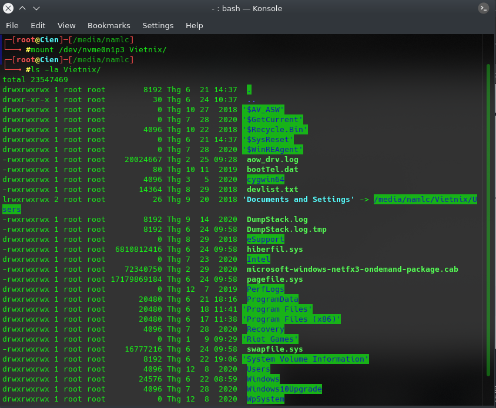
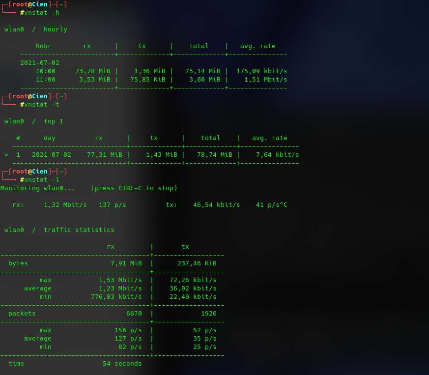
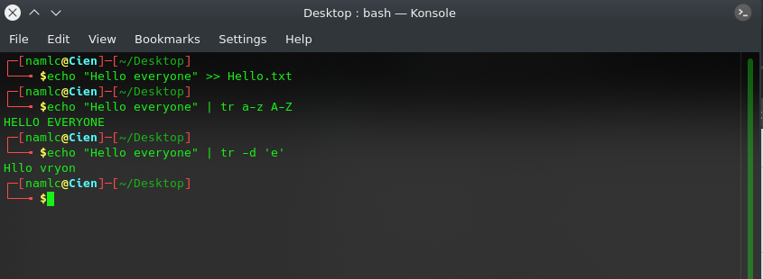
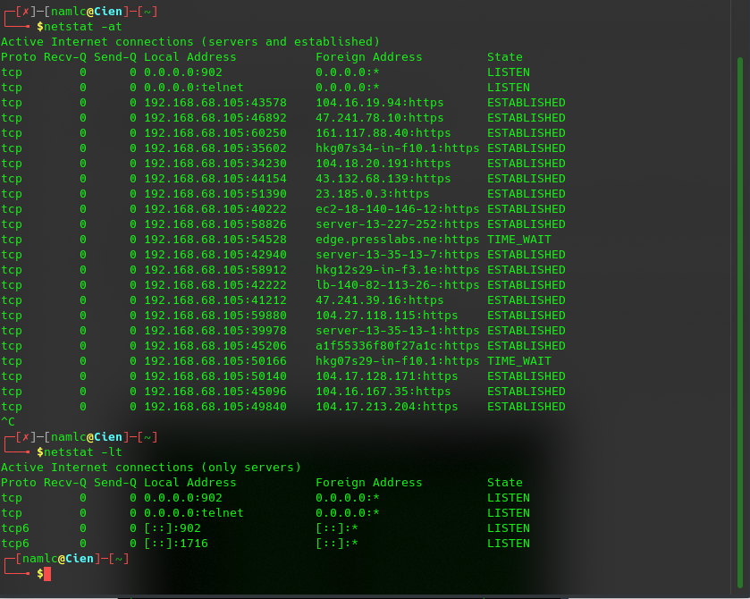

# **Report Vietnix Linux Basic**


#           PART 01: 
1. <a href='#1'> Check Diskpace
1. <a href='#2'> Check Partitions
1. <a href='#3'> Check cpu, ram, network
1. <a href='#4'> Process Monitor
1. <a href='#5'> List files/ directories
1. <a href='#6'> Find, copy, move,... files/directories
1. <a href='#7'> Basic and advanced decentralization
1. <a href='#8'> Editors command
1. <a href='#9'> Mount/ Unmount
1. <a href='#10'> Symbolic Links
1. <a href='#11'> Hard Links
1. <a href='#12'> Compressed/ Depressed
1. <a href='#13'> Bandwidth monitoring
1. <a href='#14'> nmap, telnet, ping, ssh, transfer files from local to public host
1. <a href='#15'> Generate ssh-key
1. <a href='#16'> Read file contents without editor
1. <a href='#17'> Add content to the end of the file
1. <a href='#18'> Basic command Linux
1. <a href='#19'> Standard Input, Output, Error
1. <a href='#20'> Redirecting Standard Input, Output, Error
1. <a href='#21'> /dev/null

***
## *man* 
Command in Linux is used to display the user manual of any command that we can run on the terminal.
* Syntax: 
```
man [COMMAND NAME]
```

<div id='1'></div>

### 1. CheckDiskpace
- Shows the amount of disk space used and available on Linux file systems.
* Syntax: 
``` 
df -a 
```
  


<div id='2'></div>

### 2. Check Partitions
- The lsblk command lists all the block devices of your system along with their logical partitions. 
* Syntax: 
``` 
lsblk 
```


- The fdisk command that stands for Format-disk or Fixed-disk is basically used to create or delete hard disk partitions.
* Syntax: 
```
fdisk -l
```


<div id='3'></div>

### 3. Check cpu, ram, network
#### 3.1 CPU
- **lscpu** is a small and quick command that does not need any options.
* Syntax: 
```
lscpu
```


#### 3.2 RAM 

- The most popular command in order to check your RAM on Linux is to use the **free** command.
* Syntax: 
```
free -h
```


#### 3.3 Network

- **netstat** is a command line tool for monitoring incoming and outgoing network packets statistics as well as interface statistics. 
* Syntax: 
```
netstat
```


```
netstat -lnp 
    * -lnp: Listen all active listening ports connection
```


<div id='4'></div>

### 4. Process Monitor

- The **top** command used to dipslay all the running and active real-time processes in ordered list and updates it regularly.
* Syntax: 
```
top
```


-  **Htop** is a much advanced interactive and real time Linux process monitoring tool.
* Syntax:
```
htop
```


- **ps** command will report a snapshot of the current processes.
* Syntax:

```
ps -aux
    * -aux: Print all process on the server
```


<div id='5'></div>

### 5. List files/ directories
- The **ls** command also accepts some flags which are additional information that changes how files or directories are listed in your terminal.
* Syntax: 
```
ls -la
    -la: to list files or directories in a table format with extra information including hidden files or directories
```

[](src/05_ls.png)

<div id='6'></div>

### 6. Find, copy, move,... files/directories
- The **find** command allows you to search for files for which you know the approximate filenames.
* Syntax: 
```
find . -name mydata\*
    . is indicates the current directory.
    -name if you want the search for a word or phrase to be case insensitive.
```


* Syntax:
```
locate -b 'mydata.txt'
```


- The **which** command returns the absolute path of the executable that is called when a command is issued. 
* Syntax: 
```
which -a firefox
```
- The **whereis** command is used to find out where the binary, source, and man page files for a command are located.
```
whereis nmap
```


- **cp** is a command to copy files and directories.
- **mv** is used to move one or more files or directories from one place to another in a file system like UNIX
* Syntax:
```
cp [OPTIONS] SOURCE... DESTINATION
mv [OPTIONS] SOURCE... DESTINATION
```


<div id='7'></div>

### 7. System Decentralization
- **chmod** modifies the permissions of the file specified by file name to the permissions specified by permissions.
* Syntax: 
```
chmod options permissions <file_name>
```
Options:
```
* u: user
* g: group
* o: owner  
```
Permissions:  
```
* r: read (4)
* w: write (2)
* x: excute (1)
```
- Example:
```
chmod u+x hello.sh
or
chmod 700 hello.sh
```


- **chown** used to change the owner. 
- **chgrp** used to change the group.
* Syntax: 
```
chown OWNER FILE
chgrp GROUP FILE
```


<div id='8'></div>

### 8. Editors command

- **vi** is one of the best ways to editing files using the screen-oriented text editor.
- **vim** comes from **vi** Improved because it is the successor of an older editor called **vi**.
- **nano** is a newer text editor in Linux systems. It’s simpler and easier to use than **vim**.

* Syntax: 
```
vi filename
gedit filename
nano filename
```

<div id='9'></div>

### 9. Mount/ Unmount
#### 9.1 Mount
- **mount** command to attach (mount) file systems and removable devices such as USB flash drives at a particular mount point in the directory tree.

* Syntax: 
```
mount [OPTION...] DIRECTORY
mount [OPTION...] DEVICE_NAME
```



#### 9.2 Umount
- **unmount** to detach a mounted file system.

* Syntax: 
```
umount DEVICE_NAME
umount DIRECTORY
```


<div id='10'></div>

### 10. Sympolic Links
- **ln** is a command-line utility for creating links between files. To create a symbolic link, use the *-s (--symbolic)* option.
* Syntax: 
```
ln -s SOURCE_FILE SYMBOLIC_LINK
```


<div id='11'></div>

### 11. Hard Links

* Syntax:
```
ln SOURCE_FILE SYMBOLIC_LINK
```


<div id='12'></div>

### 12. Compressed/ Depressed
#### 12.1 zip 
- The **zip** command is for .zip files and is used to compress one or more files into .zip format files.
* Syntax: 
```
zip [parameter] [Target compressed file.zip] [Source File]
```


- The **unzip** command is used to compress and compress the compressed package in .zip format.

* Syntax: 
```
unzip [parameter] [Unzip file name.zip]
```


#### 12.2 tar 

- **tar** combines compression and decompression together, but uses different parameters.

* Syntax: 
```
tar [parameter] [Compressed file name] [Uncompressed file name]
    -c Create a new compressed file.
    -f<backup file>  Specify the compressed file.
    -v Display the instruction execution process.
    -x Release the file from the backup file, that is, unzip the file.
    -z Generate compressed files with tar and compress them with gzip.
```


<div id='13'></div>

### 13. Bandwidth monitoring
- **bmon** is also a straightforward command line tool for monitoring network bandwidth utilization and a rate estimator, in Linux.
* Syntax: 
```
# apt install bmon
# bmon
```


- **vnstat** is a console-based network traffic monitoring tool design for Linux and BSD. It will keep a log of the network traffic for selected network interfaces.
- Install vnstat: `apt install vnstat`
> Configure vnstat interface: `vi /etc/vnstat.conf`  


- Syntax: 
```
vnstat [OPTIONS]

        -h: check hourly
        -d: check daily
        -t: check time
```




<div id='14'></div>

### 14. nmap, telnet, ping, ssh, transfer files from local to public host
#### 14.1 nmap
- **nmap** - Network exploration tool and security / port scanner
* Syntax: 
```
nmap [Scan Type...] [Options] target
```
Options:
```
    -A: scan to find out OS Information 
    -sA: scan to detect firewall settings
    -sV: find information about service versions
    -p: scan ports
    -sP: scan to see which servers are active
    -T4: to scan faster
```


#### 14.2 TELNET
- **telnet** helps to connect to a remote Linux computer and run programs remotely and conduct administration.
* Syntax: 
```
telnet server-IP address
```


#### 14.3 SSH
- **SSH** which stands for Secure Shell, It is used to connect to a remote computer securely. 
* Syntax: 
```
SSH username@ip-address or hostname
```


#### 14.4 PING
- **ping** is commonly used to check whether your connection to the server is healthy or not.
* Syntax: 
```
ping [options] {ip or hostname}
ping {ip or hostname}
```


#### 14.5 SFTP
- **SFTP** (SSH File Transfer Protocol) is a secure file protocol that is used to access, manage, and transfer files over an encrypted SSH transport.
* Syntax: 
```
sftp remote_username@server_ip_or_hostname
```


<div id='15'></div>

### 15. Generate ssh-key
- **ssh-keygen** is a tool for creating new authentication key pairs for SSH. Such key pairs are used for automating logins, single sign-on, and for authenticating hosts.
* Syntax: 
```
ssh-keygen -t -rsa
```
- Create ssh-key on client


- Send ssh-key from client to server


- Connect with ssh-keygen


<div id='16'></div>

### 16. Read file contents without editor
- **cat** displays the content of one or more text files on the screen without pausing.
- **head** displays the first 10 lines of a file.
- **tail** displays the last 10 lines of a file.
- **more** displays the content of a text file one screen at a time.

* Syntax: 
```
cat filename
head filename
tail filename
more filename
```


<div id='17'></div>

### 17. Add content to the end of the file
* Syntax: 
```
echo <content> >> file_name
```


<div id='18'></div>

### 18. Basic command Linux
#### 18.1 grep
- **grep** used to search text and strings in a given file.
* Syntax:
```
grep -r "content" /path/to/file/name/
```


#### 18.2 awk
- **awk** can process textual data files and streams. The input data is divided into records and fields.
* Syntax: 
```
awk '{ print }' file.txt
```


#### 18.3 sed
- **sed** is used for finding, filtering, text substitution, replacement and text manipulations like insertion, deletion search etc. 
* Syntax: 
```
sed OPTIONS… [SCRIPT] [INPUTFILE…] 
```


#### 18.4 tr
- **tr** is a command line utility for translating or deleting characters.
* Syntax:
```
tr [OPTION] SET1 [SET2]
```
Options
```
-c : complements the set of characters in string.i.e., operations apply to characters not in the given set
-d : delete characters in the first set from the output.
-s : replaces repeated characters listed in the set1 with single occurrence
-t : truncates set1
```


#### 18.5 sort
- **sort** is used to sort a file, arranging the records in a particular order.
* Syntax: 
```
sort filename
```


#### 18.6 uniq
- **uniq** is a command line utility that reports or filters out the repeated lines in a file.
* Syntax: 
```
uniq [OPTION] [INPUT[OUTPUT]]
```


#### 18.7 cut
- **cut** is a command for cutting out the sections from each line of files and writing the result to standard output.
* Syntax: 
```
cut OPTION... [FILE]...
```


#### 18.8 join
- **join** is a command line utility for joining lines of two files on a common field.
* Syntax: 
```
diff [options] File1 File2 
```


#### 18.9 diff
- **diff** is used to display the differences in the files by comparing the files line by line.
* Syntax: 
```
join [OPTION] FILE1 FILE2
```
- Special symbols are:
```
a : add
c : change
d : delete
```


#### 18.10 xargs
- **xargs** is used to build and execute commands from standard input.
* Syntax: 
```
xargs [options] [command]
```
- xargs options :
```
-0 : input items are terminated by null character instead of white spaces
-a file : read items from file instead of standard input
–delimiter = delim : input items are terminated by a special character
-E eof-str : set the end of file string to eof-str
-I replace-str : replace occurrences of replace-str in the initial arguments with names read from standard input
-L max-lines : use at-most max-lines non-blank input lines per command line.
-p : prompt the user about whether to run each command line and read a line from terminal.
-r : If the standard input does not contain any nonblanks, do not run the command
-x : exit if the size is exceeded.
–help : print the summary of options to xargs and exit
–version : print the version no. of xargs and exit
```


#### 18.11 traceroute
- **traceroute** prints the route that a packet takes to reach the host.
* Syntax: 
```
traceroute [options]  host_Address [pathlength]
```
Options: 
```
-4: Use ip version 4 i.e. use IPv4
-6: Use ip version 6 i.e. use IPv6
-F: Do not fragment packet.
-n: Do not resolve IP addresses to their domain names.
-p: Set the destination port to use. Default is 33434.
```


#### 18.12 netstat
- **netstat** displays various network related information such as network connections, routing tables, interface statistics, masquerade connections, multicast memberships etc.,
* Syntax:
```
netstat [-a] [-e] [-n] [-o] [-p <Protocol>] [-r] [-s] [<Interval>]
```



#### 18.13 kill
- **kill**  is a built-in command which is used to terminate processes manually. 
* Syntax: 
```
kill [OPTIONS]
```
Options:
```
-l: display all the available signals
-s : To show how to send signal to processes.
-L :This command is used to list available signals in a table format.
```


#### 18.14 pkill
- **pkill** is a command-line utility that sends signals to the processes of a running program based on given criteria.
* Syntax:
```
pkill [OPTIONS] <PATTERN>
```


#### 18.15 wc
- **wc** is used to find out number of lines, word count, byte and characters count in the files specified in the file arguments.
* Syntax: 
```
wc [OPTION]... [FILE]...
```
- Options:
```
-l: prints the number of lines present in a file.
-w: prints the number of words present in a file.
-c: displays count of bytes present in a file. 
-m: displays count of characters from a file.
```


#### 18.16 wget
- **wget** is used to download files from the server even when the user has not logged on to the system and it can work in the background without hindering the current process.
* Syntax: 
```
wget [option] [URL]
```
- Options:
```
-o: is used to direct all the messages generated by the system.
-a: is used to append the output messages to the current output log file without overwriting the file.
-i: is used to read URLs from file. 
-c: is used to resume a partially downloaded file.
```


#### 18.17 git
- **git** is a fast, scalable, distributed revision control system with an unusually rich command set that provides both high-level operations and full access to internals.
* Syntax: 
```
git <command> [<args>]
```
Commands:
```
add: Add file contents to the index
checkout: Switch branches or restore working tree files
clone: Clone a repository into a new directory
commit: Record changes to the repository
pull: Fetch from and integrate with another repository or a local branch
push: Update remote refs along with associated objects
```


#### 18.18 rsync
- **rsync** is a fast and versatile command-line utility for synchronizing files and directories between two locations over a remote shell, or from/to a remote Rsync daemon.
* Syntax: 
```
rsync options source destination
```

#### 18.19 tee
- **tee** reads the standard input and writes it to both the standard output and one or more files.
* Syntax: 
```
tee [OPTION]... [FILE]...
```

#### 18.20 mkdir
- **mkdir** to create directories.
* Syntax:
```
mkdir [options...] [directories ...]
```


<div id='19'></div>

### 19. Standard Input, Output, Error.
- When a command begins running, it usually expects that the following files are already open: **standard input, standard output, and standard error**  
-  When you enter a command, if no file name is given, your keyboard is the **standard input**, sometimes denoted as **stdin**. When a command finishes, the results are displayed on your screen.

- Your screen is the **standard output**, sometimes denoted as **stdout**. By default, commands take input from the standard input and send the results to **standard output**.

- Error messages are directed to **standard error**, sometimes denoted as **stderr**. By default, this is your screen.

<div id='20'></div>

### 20. Redirecting Standard Input, Output, Error.
- When the notation **>** filename is added to the end of a command, the output of the command is written to the specified file name. The **>** symbol is known as the **output redirection** operator.
- When the notation **<** filename is added to the end of a command, the input of the command is read from the specified file name. The **<** symbol is known as the **input redirection operator**.
- In addition to the **standard input and standard output**, commands often produce other types of output, such as error or status messages known as diagnostic output. Like **standard output, standard error output** is written to the screen unless it is redirected.

<div id='21'></div>

### 21. /dev/null
- Any data sent to /dev/null is discarded. 


# **~~~THE END~~~**
[Back to training task](https://github.com/namluucong/Vietnix_Training/blob/main/README.md)