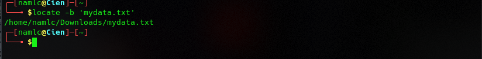

# **Report Vietnix Linux Basic**


#           PART 01: 
1. <a href='#1'> Check Diskpace
1. <a href='#2'> Check Partitions
1. <a href='#3'> Check cpu, ram, network
1. <a href='#4'> Process Monitor
1. <a href='#5'> List files/ directories
1. <a href='#6'> Find, copy, move,... files/directories
1. <a href='#7'> Basic and advanced decentralization
1. <a href='#8'> Editors command
1. <a href='#9'> Mount/ Unmount
1. <a href='#10'> Symbolic Links
1. <a href='#11'> Hard Links
1. <a href='#12'> Compressed/ Depressed
1. <a href='#13'> Bandwidth monitoring
1. <a href='#14'> nmap, telnet, ping, ssh, transfer files from local to public host
1. <a href='#15'> Generate ssh-key
1. <a href='#16'> Read file contents without editor
1. <a href='#17'> Add content to the end of the file
1. <a href='#18'> Basic command Linux
1. <a href='#19'> Standard Input, Output, Error
1. <a href='#20'> Redirecting Standard Input, Output, Error
1. <a href='#21'> /dev/null

***
## *man* 
Command in Linux is used to display the user manual of any command that we can run on the terminal.
* Syntax: 
```
man [COMMAND NAME]
```

<div id='1'></div>

### 1. CheckDiskpace
- Shows the amount of disk space used and available on Linux file systems.
* Syntax: 
``` 
df -a 
```
  


<div id='2'></div>

### 2. Check Partitions
- The lsblk command lists all the block devices of your system along with their logical partitions. 
* Syntax: 
``` 
lsblk 
```


- The fdisk command that stands for Format-disk or Fixed-disk is basically used to create or delete hard disk partitions.
* Syntax: 
```
fdisk -l
```


<div id='3'></div>

### 3. Check cpu, ram, network
#### 3.1 CPU
- **lscpu** is a small and quick command that does not need any options.
* Syntax: 
```
lscpu
```


#### 3.2 RAM 

- The most popular command in order to check your RAM on Linux is to use the **free** command.
* Syntax: 
```
free -h
```


#### 3.3 Network

- **netstat** is a command line tool for monitoring incoming and outgoing network packets statistics as well as interface statistics. 
* Syntax: 
```
netstat
```


```
netstat -lnp 
    * -lnp: Listen all active listening ports connection
```


<div id='4'></div>

### 4. Process Monitor

- The **top** command used to dipslay all the running and active real-time processes in ordered list and updates it regularly.
* Syntax: 
```
top
```


-  **Htop** is a much advanced interactive and real time Linux process monitoring tool.
* Syntax:
```
htop
```


- **ps** command will report a snapshot of the current processes.
* Syntax:

```
ps -aux
    * -aux: Print all process on the server
```


<div id='5'></div>

### 5. List files/ directories
- The **ls** command also accepts some flags which are additional information that changes how files or directories are listed in your terminal.
* Syntax: 
```
ls -la
    -la: to list files or directories in a table format with extra information including hidden files or directories
```

[](src/05_ls.png)

<div id='6'></div>

### 6. Find, copy, move,... files/directories
- The **find** command allows you to search for files for which you know the approximate filenames.
* Syntax: 
```
find . -name mydata\*
    . is indicates the current directory.
    -name if you want the search for a word or phrase to be case insensitive.
```


* Syntax:
```
locate -b 'mydata.txt'
```



- The **which** command returns the absolute path of the executable that is called when a command is issued. 
* Syntax: 
```
which -a firefox
```
- The **whereis** command is used to find out where the binary, source, and man page files for a command are located.
```
whereis nmap
```


- **cp** is a command to copy files and directories.
- **mv** is used to move one or more files or directories from one place to another in a file system like UNIX
* Syntax:
```
cp [OPTIONS] SOURCE... DESTINATION
mv [OPTIONS] SOURCE... DESTINATION
```


<div id='7'></div>

### 7. System Decentralization
- **chmod** modifies the permissions of the file specified by file name to the permissions specified by permissions.
* Syntax: 
```
chmod options permissions <file_name>
```
Options:
```
* u: user
* g: group
* o: owner  
```
Permissions:  
```
* r: read (4)
* w: write (2)
* x: excute (1)
```
- Example:
```
chmod u+x hello.sh
or
chmod 700 hello.sh
```


- **chown** used to change the owner. 
- **chgrp** used to change the group.
* Syntax: 
```
chown OWNER FILE
chgrp GROUP FILE
```


<div id='8'></div>

### 8. Editors command

- **vi** is one of the best ways to editing files using the screen-oriented text editor.
- **vim** comes from **vi** Improved because it is the successor of an older editor called **vi**.
- **nano** is a newer text editor in Linux systems. It’s simpler and easier to use than **vim**.

* Syntax: 
```
vi filename
gedit filename
nano filename
```

<div id='9'></div>

### 9. Mount/ Unmount
#### 9.1 Mount
- **mount** command to attach (mount) file systems and removable devices such as USB flash drives at a particular mount point in the directory tree.

* Syntax: 
```
mount [OPTION...] DIRECTORY
mount [OPTION...] DEVICE_NAME
```


#### 9.2 Umount
- **unmount** to detach a mounted file system.

* Syntax: 
```
umount DEVICE_NAME
umount DIRECTORY
```


<div id='10'></div>

### 10. Sympolic Links
- **ln** is a command-line utility for creating links between files. To create a symbolic link, use the *-s (--symbolic)* option.
* Syntax: 
```
ln -s SOURCE_FILE SYMBOLIC_LINK
```


<div id='11'></div>

### 11. Hard Links

* Syntax:
```
ln SOURCE_FILE SYMBOLIC_LINK
```


<div id='12'></div>

### 12. Compressed/ Depressed
#### 12.1 zip 
- The **zip** command is for .zip files and is used to compress one or more files into .zip format files.
* Syntax: 
```
zip [parameter] [Target compressed file.zip] [Source File]
```


- The **unzip** command is used to compress and compress the compressed package in .zip format.

* Syntax: 
```
unzip [parameter] [Unzip file name.zip]
```


#### 12.2 tar 

- **tar** combines compression and decompression together, but uses different parameters.

* Syntax: 
```
tar [parameter] [Compressed file name] [Uncompressed file name]
    -c Create a new compressed file.
    -f<backup file>  Specify the compressed file.
    -v Display the instruction execution process.
    -x Release the file from the backup file, that is, unzip the file.
    -z Generate compressed files with tar and compress them with gzip.
```


<div id='13'></div>

### 13. Bandwidth monitoring
- **bmon** is also a straightforward command line tool for monitoring network bandwidth utilization and a rate estimator, in Linux.
* Syntax: 
```
# apt install bmon
# bmon
```


<div id='14'></div>

### 14. nmap, telnet, ping, ssh, transfer files from local to public host
#### 14.1 nmap
- **nmap** - Network exploration tool and security / port scanner
* Syntax: 
```
nmap [Scan Type...] [Options] target
```
Options:
```
    -A: scan to find out OS Information 
    -sA: scan to detect firewall settings
    -sV: find information about service versions
    -p: scan ports
    -sP: scan to see which servers are active
    -T4: to scan faster
```

