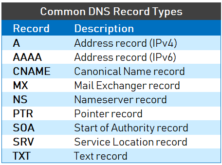

# **Report Vietnix Linux Basic**

#           PART 02: 
1. <a href='#1'> SSL
1. <a href='#2'> Domain
1. <a href='#3'> DNS
1. <a href='#4'> Hosting, VPS, Server
1. <a href='#5'> Reverse Proxy
1. <a href='#6'> Compare Nginx and Apache

***

# 1. SSL 
## What is SSL? 
- **SSL** stands for Secure Sockets Layer and, in short, it's the standard technology for keeping an internet connection secure and safeguarding any sensitive data that is being sent between two systems, preventing criminals from reading and modifying any information transferred, including potential personal details. **SSL** is the predecessor to the modern TLS encryption used today.
- A website that implements **SSL/TLS** has `HTTPS` in its URL instead of `HTTP`.

## How does SSL work ?

- In order to provide a high degree of privacy, **SSL** encrypts data that is transmitted across the web. This means that anyone who tries to intercept this data will only see a garbled mix of characters that is nearly impossible to decrypt.
- **SSL** initiates an authentication process called a handshake between two communicating devices to ensure that both devices are really who they claim to be.
- **SSL** also digitally signs data in order to provide data integrity, verifying that the data is not tampered with before reaching its intended recipient.

## Types of SSL
#### Extended Validation (EV SSL) Certificates
- **EV SSL** checks the right of the applicant to use a specific domain name plus, it conducts a thorough vetting of the organization.

#### Organization Validated (OV SSL) Certificates
- **OV SSL** checks the right of the applicant to use a specific domain name PLUS it conducts some vetting of the organization.

#### Domain Validated (DV SSL) Certificates
- **DV SSL** checks the right of the applicant to use a specific domain name.

#### Subject Alternative Names (SANs SSL)
- **SANs SSL** allow you to secure a primary domain and then add additional domains to the Subject Alternative Name field of the certificate. 
#### Unified Communications Certificates (UCC)
- **UCC SSL** are also considered Multi-Domain SSL Certificates and have the same benefits.
#### Wildcard SSL Certificates
- **Wildcard SSL** are available as both OV and DV, and are used to secure a base domain and unlimited subdomains.

# 2. Domain

## What is Domain? 
- When referring to an Internet address or name, a **domain** or **domain name** is the location of a website.

### Types of Domain
- These top-level domains (TLD) became known as domain name extensions and represent the highest level in the Domain Name System hierarchy. 
- **Country code top-level domains (ccTLD)**. These domain extensions can be useful if you’re building a website in a specific country and want to signal to your visitors that they’ve come to the right place. For example, websites based out of the US can use the `.us` extension, while companies from Vietnam can use the `.vn` extension. 
- **generic top-level domains (gTLDs)** A lot of **gTLDs** can be registered even if you don’t satisfy the requirements, but for some like ‘.mil’ and ‘.edu’ you must fit the requirements.

# 3. DNS
- The Domain Name System (DNS) turns domain names into IP addresses, which browsers use to load internet pages. Every device connected to the internet has its own IP address, which is used by other devices to locate the device. 

### Types of DNS: 

# 4. Hosting, VPS, Server

### What is Server ?
- A server is a computer or system that provides resources, data, services, or programs to other computers, known as clients, over a network.

### Types of Server: 

- File server: Used to transfer files from one server to another based on a network connection: LAN, Internet, etc. 
- Mail server: Support sending and receiving mail (gmail, yahoo mail, yandex, amazon email service). 
- Web server: is a server with the function of storing information and data of the website, creating a connection environment for customers to access the website easily. 
- Application server:Used to run ERP management software, CRM software in the business, can also be understood as a server providing web services, mail, file server, ...). 
- Database server: A dedicated server used for database administration. On the server, professional database management software is installed: SQL server, MySQL, Oracle... 
- Domain server: Is a domain name resolution system 

### VPS
- Virtual Private Server (VPS) is a virtual server, created by dividing the physical server into many other servers. 
- VPS is created using virtualization technology instead of using conventional management software (hosting control panel) to manage. 

### Web Hosting
- Web hosting is a service that allows organizations and individuals to post a website or web page onto the Internet.

#### Types of Hosting: 
- **Shared hosting** is the solution for website owners with lower traffic sites.
- **Dedicated hosting** you rent an entire physical server for your business. 
- **VPS hosting (Virtual Private Server)** A physical server is installed virtualization application to create many virtual servers.
- **Cloud hosting** is a hosting service operated on a cloud computing platform. 
- **WordPress hosting** is a service specifically offered to WordPress site owners. 

# 5. Reverse Proxy
- A **proxy server** is a go‑between or intermediary server that forwards requests for content from multiple clients to different servers across the Internet. 
- **Reverse proxy** are usually deployed to enhance security, current levels and reliability. 

A reverse proxy operates by:
    - Receiving a user connection request
    - Completing a TCP three-way handshake, terminating the initial connection
    - Connecting with the origin server and forwarding the original request

# 6. Nginx vs Apache
- **Nginx and Apache** are two of the biggest open source web services worldwide, handling more than half of the internet’s total traffic. They’re both designed to handle different workloads and to complement various types of software, creating a comprehensive web stack.

### Nginx vs Apache - Comparison: 

- **Performance**: NGINX's memory consumption is lower, it tends to be able to handle more connections simultaneously without overloading the host server.
- **Static vs Dynamic Content**:
    * Static: Apache and NGINX both take the same basic approach: They deliver the static files requested by a website visitor.
    * Dynamic: Apache is designed to process dynamic content too, by integrating a processor of suitable languages into every worker instance. As a result, Apache can accommodate dynamic content in the server itself, with no need to depend on any external components. 
- **OS**: Apache works on all types of Unix-like systems (Linux or BSD) and fully supports Microsoft Windows. Nginx also runs on some of them and also supports Windows, but the performance is not as strong. 
- **Security**: Apache and NGINX handle these various security requirements is beyond the scope of this page; however, it is fair to say that Apache and NGINX are both designed to be secure by default.
- **Documentation** Apache and NGINX are both very well-documented platforms.

