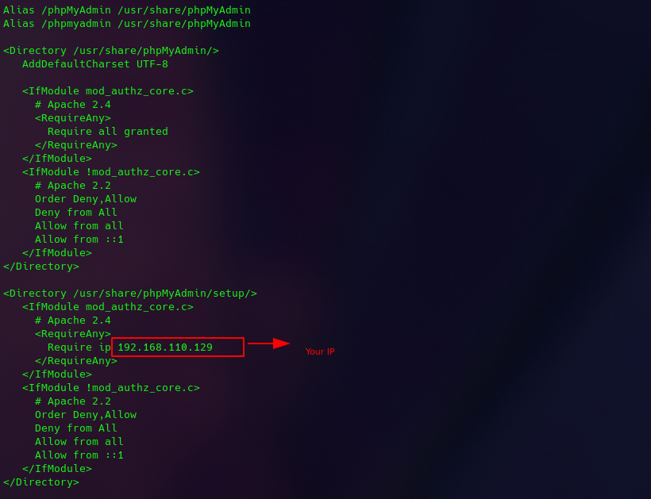

# **Report Vietnix Linux Basic**

# Part 03: 
1. <a href='#1'> Reverse Proxy
1. <a href='#2'> vsftpd
1. <a href='#3'> phpmyadmin
1. <a href='#4'> Access port 80, 443, 3306, 22
1. <a href='#5'> Remote MySQL 
1. <a href='#6'> Build wordpress
1. <a href='#7'> Build Laravel
1. <a href='#8'> Compile from Src

<div id='1'></div>

## 1. Reverse Proxy


- create repo nginx: `vi /etc/yum.respo.d/nginx.repo`
```
[nginx]

name=nginx repo

baseurl=http://nginx.org/packages/centos/7/$basearch/

gpgcheck=1
```
- Import nginx sign:
```
wget --no-check-certificate -O nginx_signing.key https://nginx.org/keys/nginx_signing.key

rpm --import nginx_signing.key
```
- Install nginx: `yum install nginx -y`
- Configure firewall: 
```
firewall-cmd --zone=public --permanent --add-port=80/tcp

firewall-cmd --zone=public --permanent --add-port=443/tcp

firewall-cmd --reload
```
- Configure nginx: 

- Result: 


<div id='2'></div>

## 2. vsftpd

- Install FTP Server: 
```
yum install vsftpd
systemctl start vsftpd
systemctl enable vsftpd
```
- Configure Firewall: 
```
firewall-cmd --permanent --add-port=21/tcp
firewall-cmd --permanent --add-service=ftp
firewall-cmd --reload
```
> Backup file conf: `cp /etc/vsftpd/vsftpd.conf /etc/vsftpd/vsftpd.conf.backup`
> Configure VSFTPD: `vi /etc/vsftpd/vsftpd.conf`
- Edit file conf: 
```
anonymous_enable=NO
local_enable=YES 
write_enable=YES
chroot_local_user=YES
allow_writeable_chroot=YES
chroot_list_enable=YES
chroot_list_file=/etc/vsftpd/chroot_list

pasv_min_port=30000
pasv_max_port=31000

userlist_enable=YES
userlist_file=/etc/vsftpd/user_list
userlist_deny=NO

```


- Add user FTP: 
```
adduser ftp_user
passwd ftp_user
```
- Add user to file user_list to access: `echo 'ftp_user' >> /etc/vsftpd/user_list`


> Add user to file chroot_list: `echo 'ftp_user' > /etc/vsftpd/chroot_list`
- Check with Filezilla: 
> Client:
  

> Server: 


<div id='3'></div>

## 3. phpmyadmin

- Install phpmyadmin: `yum install phpmyadmin`
> Configure phpmyadmin:
  

>Result: 


<div id='4'></div>

## 4. Access port 80, 443, 3306, 22

- Using `firewall-cmd` to add port: 
```
firewall-cmd --permanent --add-port=22/tcp
firewall-cmd --permanent --add-port=80/tcp
firewall-cmd --permanent --add-port=443/tcp
firewall-cmd --permanent --add-port=3306/tcp
firewall-cmd --reload
```


<div id='5'></div>

## 5. Remote MySQL

- Confirgure MySQL: `vi /etc/my.cnf` 
```
bind-address= <IP_MySQL_Server>
port = 3306
```


- Add port 3306: 
```
firewall-cmd --permanent --add-port=3306/tcp
firewall-cmd --reload
```

> create user to remote: 


> Remote db from client: 


<div id='6'></div>

## 6. Build Wordpress

- Start apache: `systemctl start httpd`
- Create Database: `mysql -u root -p`
```
CREATE DATABASE wordpress; 
GRANT ALL PRIVILEGES on wordpress.* to 'wordpress_user' identified by '123456!@#';
FLUSH PRIVILEGES;
```


- Install wordpress: 
```
cd /var/www/html/
wget https://wordpress.org/latest.zip
unzip latest.zip
cp wordpress/wp-config-sample.php wordpress/wp-config.php
```
- Configure wordpress: `vi /var/www/html/wordpress/wp-config.php`


- Login wordpress on web browser: `<dia_chi_ip>/wordpress`


<div id='7'></div>

## 7. Build Laravel

- Add Yum repo: 
```
rpm -Uvh http://dl.fedoraproject.org/pub/epel/7/x86_64/Packages/e/epel-release-7-13.noarch.rpm
rpm -Uvh http://rpms.famillecollet.com/enterprise/remi-release-7.rpm
```
- Install composer: 
```
curl -sS https://getcomposer.org/installer | php
mv composer.phar /usr/bin/composer
chmod +x /usr/bin/composer
```


- Install laravel: 
```
cd /var/www
composer create-project --prefer-dist laravel/laravel blog
cd /var/www/laravel
composer install
chown -R apache:apache /var/www/laravel
chmod -R 755 /var/www/laravel
chmod -R 755 /var/www/laravel/storage
chcon -R -t httpd_sys_rw_content_t /var/www/laravel/storage
```


- Set encryp key:
```
cp .env.sample .env
php artisan key:generate
```
> Create db for laravel: 


- Create VHost: `vi /etc/httpd/conf/httpd.conf`


> Result: 


<div id='8'></div>

## 8. Compile from Src

### Apache

- Install epel: `yum install epel-release`
- Install required tool compilation: `yum install autoconf expat-devel libtool libnghttp2-devel pcre-devel -y`
- Download source code: 
```
wget https://github.com/apache/httpd/archive/2.4.48.tar.gz
wget https://github.com/apache/apr/archive/1.7.0.tar.gz
wget https://github.com/apache/apr-util/archive/1.6.1.tar.gz
```

- Unpack source code:
```
tar -zxvf 2.4.48.tar.gz
tar -zxvf 1.7.0.tar.gz
tar -zxvf 1.6.1.tar.gz
```


- APR and APR-Util: 
```
cp -r apr-1.7.0 httpd-2.4.48/srclib/apr
cp -r apr-1.6.1 httpd-2.4.48/src/lib/apr-util
```
- Compile source code: 
```
cd httpd-2.4.48
./buildconf
./configure --enable-so
make
```


- Install **httpd**: `make install`
- Add Apache excutables to PATH: `vi /etc/profile.d/httpd.sh`
```
pathmunge /usr/local/apache2/bin
```
- Add Systemd entry: `vi /etc/systemd/system/httpd.service`


- Add user and group apache: 
```
groupadd apache
useradd apache -g apache --no-create-home --shell /sbin/nologin
```
- Edit file **/usr/local/apache2/conf/httpd.conf**: 
> User apache
> Group apache
- Start service:
```
systemctl daemon-reload
systemctl start httpd
```


- Install **Development Tools**: `yum group -y 'Development Tools'`
- Install optional Nginx dependencies: `yum install -y perl perl-devel perl-ExtUtils-Embed libxslt libxslt-devel libxml2 libxml2-devel gd gd-devel GeoIP GeoIP-devel`
- Download Nginx source code and Nginx dependencies: 
```
wget https://nginx.org/download/nginx-1.13.2.tar.gz && tar zxvf nginx-1.13.2.tar.gz

wget https://ftp.pcre.org/pub/pcre/pcre-8.40.tar.gz && tar xzvf pcre-8.40.tar.gz

wget https://www.zlib.net/zlib-1.2.11.tar.gz && tar xzvf zlib-1.2.11.tar.gz

wget https://www.openssl.org/source/openssl-1.1.0f.tar.gz && tar xzvf openssl-1.1.0f.tar.gz
```


- Copy nginx manual page: 
```
cd /nginx-1.13.2
cp ~/nginx-1.13.2/man/nginx.8 /usr/share/man/man8
gzip /usr/share/man/man8/nginx.8
man nginx
```


- Configure, compile and install Nginx: 
```
./configure
make
make install
```
- Check version: `nginx -V`


- Create user and group: `useradd --system --home /var/cache/nginx --shell /sbin/nologin --comment "nginx user" --user-group nginx`
- Create service nginx: `vi /usr/lib/systemd/system/nginx.service`
```
[Unit]
Description=nginx - high performance web server
Documentation=https://nginx.org/en/docs/
After=network-online.target remote-fs.target nss-lookup.target
Wants=network-online.target

[Service]
Type=forking
PIDFile=/var/run/nginx.pid
ExecStartPre=/usr/sbin/nginx -t -c /etc/nginx/nginx.conf
ExecStart=/usr/sbin/nginx -c /etc/nginx/nginx.conf
ExecReload=/bin/kill -s HUP $MAINPID
ExecStop=/bin/kill -s TERM $MAINPID

[Install]
WantedBy=multi-user.target

```

- Start service: 
```
systemctl start nginx
systemctl enable nginx
```
> Check result:  


## Advaned Configure
### Reverse Proxy

- Import signing key: `wget --no-check-certificate -O nginx_signing.key https://nginx.org/keys/nginx_signing.key`

> Configure nginx: 


>Result: 


### vsftpd 

- Install libcap library: 
```
cd /opt
wget https://rpmfind.net/linux/centos/7.5.1804/os/x86_64/Packages/libcap-2.22-9.el7.x86_64.rpm
wget https://rpmfind.net/linux/centos/7.5.1804/os/x86_64/Packages/libcap-devel-2.22-9.el7.x86_64.rpm
rpm -ivh libcap-2.22-9.el7.x86_64.rpm 
rpm -ivh libcap-devel-2.22-9.el7.x86_64.rpm
```
- Install vsftpd: 
```
wget https://security.appspot.com/downloads/vsftpd-3.0.3.tar.gz 
tar -xvf vsftpd-3.0.3.tar.gz cd vsftpd-3.0.3/
make && make install
```


> Configure: 


>Result: 


### phpmyadmin

- Download phpMyAdmin Archive: 
```
cd /usr/share
wget https://files.phpmyadmin.net/phpMyAdmin/5.1.1/phpMyAdmin-5.1.1-all-languages.zip
unzip phpMyAdmin-4.8.5-all-languages.zip
mv phpMyAdmin-4.8.5-all-languages phpmyadmin

chown -R apache:apache /usr/share/phpmyadmin
chmod -R 755 /usr/share/phpmyadmin
```

- Create file for phpmyadmin: `vi /usr/local/apache2/conf/phpmyadmin.conf`
```
Alias /phpMyAdmin /usr/share/phpmyadmin/
Alias /phpmyadmin /usr/share/phpmyadmin/

<Directory /usr/share/phpmyadmin/>
   AddDefaultCharset UTF-8

   <IfModule mod_authz_core.c>
     # Apache 2.4
     Require all granted
   </IfModule>
   <IfModule !mod_authz_core.c>
     # Apache 2.2
     Order Deny,Allow
     Deny from All
     Allow from 127.0.0.1
     Allow from ::1
   </IfModule>
</Directory>
```


### Laravel

- Adjust yum repo: 
```
rpm -Uvh http://dl.fedoraproject.org/pub/epel/7/x86_64/Packages/e/epel-release-7-11.noarch.rpm
rpm -Uvh http://rpms.famillecollet.com/enterprise/remi-release-7.rpm
```
- Install composer: 
```
curl -sS https://getcomposer.org/installer | php
mv composer.phar /usr/bin/composer
chmod +x /usr/bin/composer
```
- Install laravel: 
```
cd /var/www
git clone https://github.com/laravel/laravel.git
cd /var/www/laravel
composer install
chown -R apache.apache /var/www/laravel
chmod -R 755 /var/www/laravel
chmod -R 755 /var/www/laravel/storage
chcon -R -t httpd_sys_rw_content_t /var/www/laravel/storage
```
- Setup encryption key: 
```
cp .env.example .env
php artisan key:generate
```
- Create Vhost: `vi /etc/httpd/conf/httpd.conf`
```
<VirtualHost *:80>
       ServerName 192.168.110.131
       DocumentRoot /var/www/laravel/public

       <Directory /var/www/laravel>
              AllowOverride All
       </Directory>
</VirtualHost>
```


# **~~~THE END~~~**
[Back to training task](https://github.com/namluucong/Vietnix_Training/blob/main/README.md)