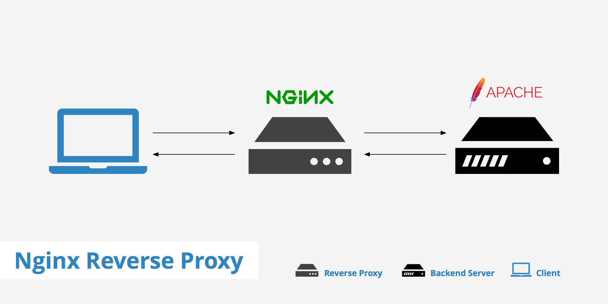

# **Report Vietnix Linux Basic**

# Part 03: 
1. <a href='#1'> Reverse Proxy
1. <a href='#2'> vsftpd
1. <a href='#3'> phpmyadmin
1. <a href='#4'> Access port 80, 443, 3306, 22
1. <a href='#5'> Remote MySQL 
1. <a href='#6'> Build wordpress
1. <a href='#7'> Build Laravel

<div id='1'></div>

### 1. Reverse Proxy



- create repo nginx: `vi /etc/yum.respo.d/nginx.repo`
```
[nginx]

name=nginx repo

baseurl=http://nginx.org/packages/centos/7/$basearch/

gpgcheck=1
```
- Import nginx sign:
```
wget --no-check-certificate -O nginx_signing.key https://nginx.org/keys/nginx_signing.key

rpm --import nginx_signing.key
```
- Install nginx: `yum install nginx -y`
- Configure firewall: 
```
firewall-cmd --zone=public --permanent --add-port=80/tcp

firewall-cmd --zone=public --permanent --add-port=443/tcp

firewall-cmd --reload
```
- Configure nginx: 

- Result: 


<div id='2'></div>

### 2. vsftpd

- Install FTP Server: 
```
yum install vsftpd
systemctl start vsftpd
systemctl enable vsftpd
```
- Configure Firewall: 
```
firewall-cmd --permanent --add-port=21/tcp
firewall-cmd --permanent --add-service=ftp
firewall-cmd --reload
```
> Backup file conf: `cp /etc/vsftpd/vsftpd.conf /etc/vsftpd/vsftpd.conf.backup`
> Configure VSFTPD: `vi /etc/vsftpd/vsftpd.conf`
- Edit file conf: 
```
anonymous_enable=NO
local_enable=YES 
write_enable=YES
chroot_local_user=YES
allow_writeable_chroot=YES
chroot_list_enable=YES
chroot_list_file=/etc/vsftpd/chroot_list

pasv_min_port=30000
pasv_max_port=31000

userlist_enable=YES
userlist_file=/etc/vsftpd/user_list
userlist_deny=NO

```


- Add user FTP: 
```
adduser ftp_user
passwd ftp_user
```
- Add user to file user_list to access: `echo 'ftp_user' >> /etc/vsftpd/user_list`


> Add user to file chroot_list: `echo 'ftp_user' > /etc/vsftpd/chroot_list`
- Check with Filezilla: 
> Client:
  

> Server: 


<div id='3'></div>

### 3. phpmyadmin

- Install phpmyadmin: `yum install phpmyadmin`
> Configure phpmyadmin:
  

>Result: 


<div id='4'></div>

### 4. Access port 80, 443, 3306, 22

- Using `firewall-cmd` to add port: 
```
firewall-cmd --permanent --add-port=22/tcp
firewall-cmd --permanent --add-port=80/tcp
firewall-cmd --permanent --add-port=443/tcp
firewall-cmd --permanent --add-port=3306/tcp
firewall-cmd --reload
```


<div id='5'></div>

### 5. Remote MySQL

- Confirgure MySQL: `vi /etc/my.cnf` 
```
bind-address= <IP_MySQL_Server>
port = 3306
```


- Add port 3306: 
```
firewall-cmd --permanent --add-port=3306/tcp
firewall-cmd --reload
```

> create user to remote: 


> Remote db from client: 


<div id='6'></div>

### 6. Build Wordpress

- Start apache: `systemctl start httpd`
- Create Database: `mysql -u root -p`
```
CREATE DATABASE wordpress; 
GRANT ALL PRIVILEGES on wordpress.* to 'wordpress_user' identified by '123456!@#';
FLUSH PRIVILEGES;
```


- Install wordpress: 
```
cd /var/www/html/
wget https://wordpress.org/latest.zip
unzip latest.zip
cp wordpress/wp-config-sample.php wordpress/wp-config.php
```
- Configure wordpress: `vi /var/www/html/wordpress/wp-config.php`


- Login wordpress on web browser: `<dia_chi_ip>/wordpress`


<div id='7'></div>

### 7. Build Laravel

- Add Yum repo: 
```
rpm -Uvh http://dl.fedoraproject.org/pub/epel/7/x86_64/Packages/e/epel-release-7-13.noarch.rpm
rpm -Uvh http://rpms.famillecollet.com/enterprise/remi-release-7.rpm
```
- Install composer: 
```
curl -sS https://getcomposer.org/installer | php
mv composer.phar /usr/bin/composer
chmod +x /usr/bin/composer
```


- Install laravel: 
```
cd /var/www
composer create-project --prefer-dist laravel/laravel blog
cd /var/www/laravel
composer install
chown -R apache:apache /var/www/laravel
chmod -R 755 /var/www/laravel
chmod -R 755 /var/www/laravel/storage
chcon -R -t httpd_sys_rw_content_t /var/www/laravel/storage
```


- Set encryp key:
```
cp .env.sample .env
php artisan key:generate
```
> Create db for laravel: 


- Create VHost: `vi /etc/httpd/conf/httpd.conf`


> Result: 


# **~~~THE END~~~**
[Back to training task](https://github.com/namluucong/Vietnix_Training/blob/main/README.md)