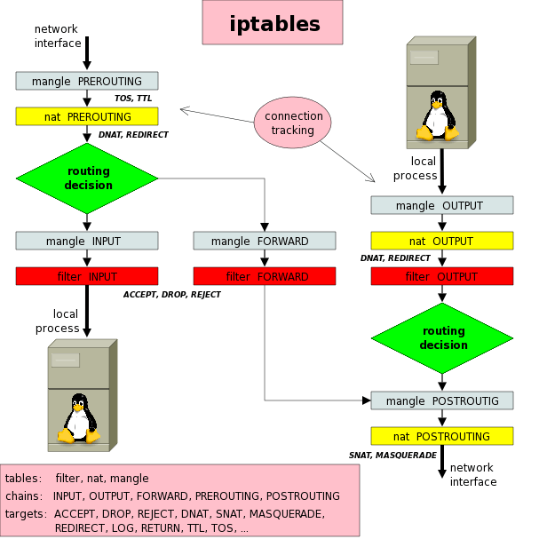
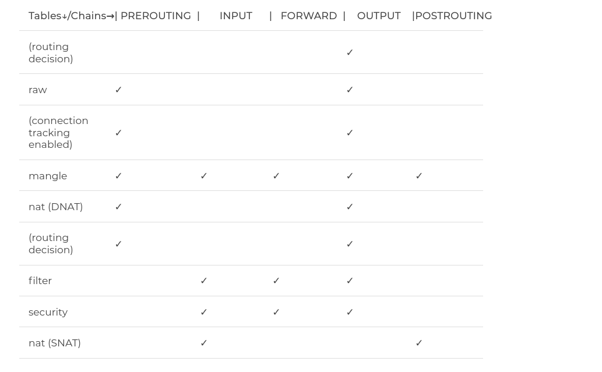
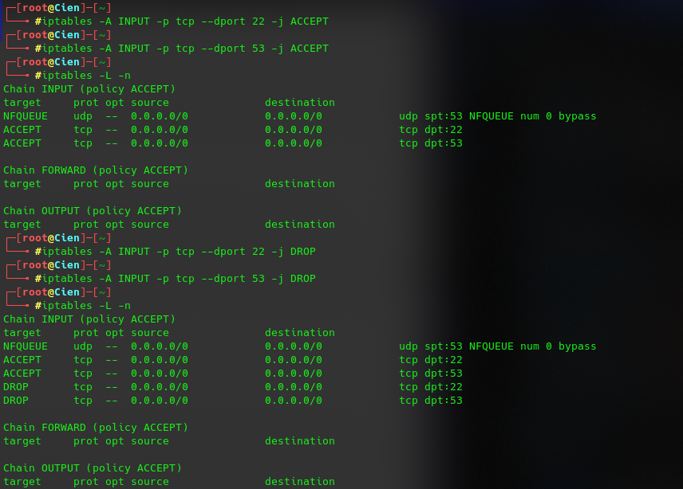
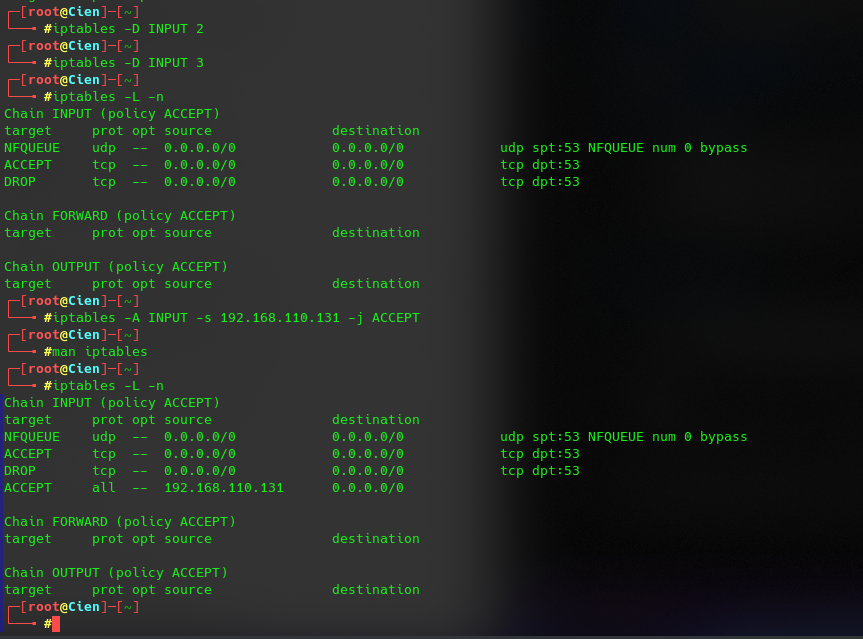
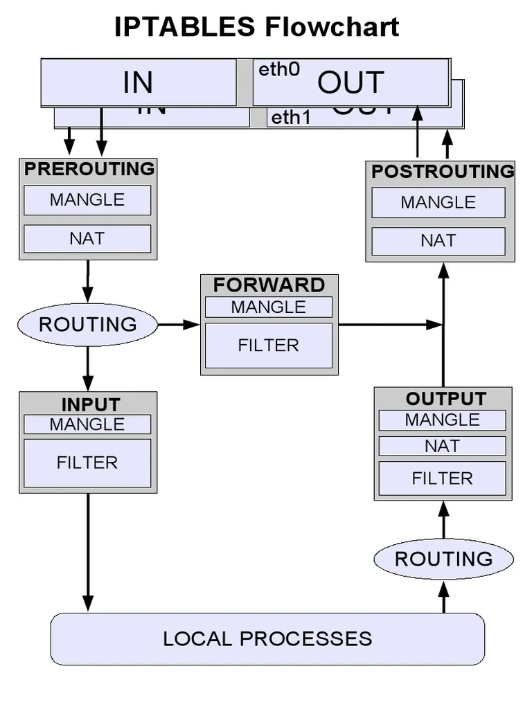
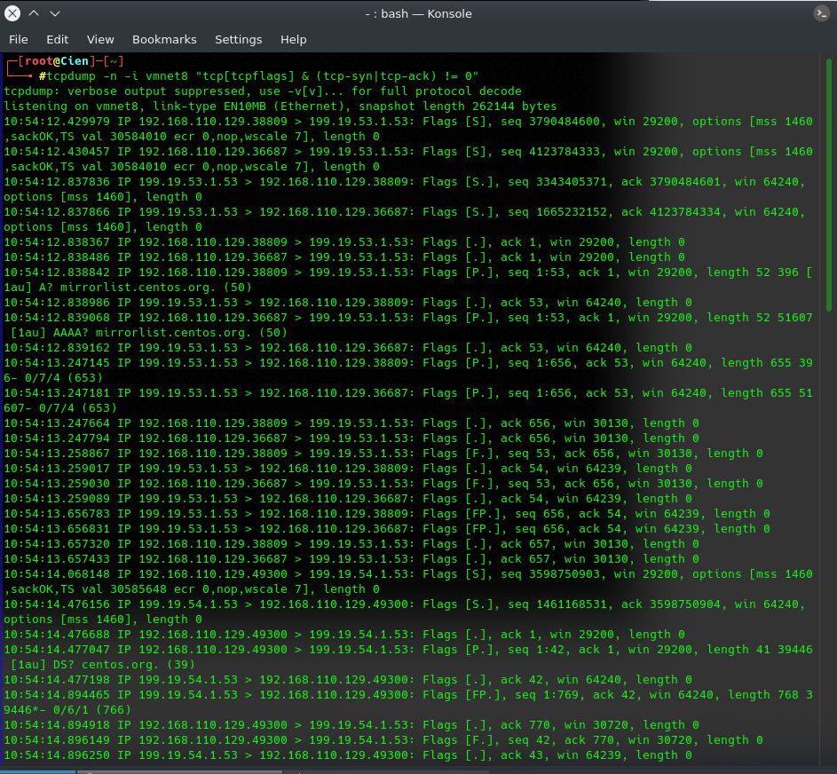
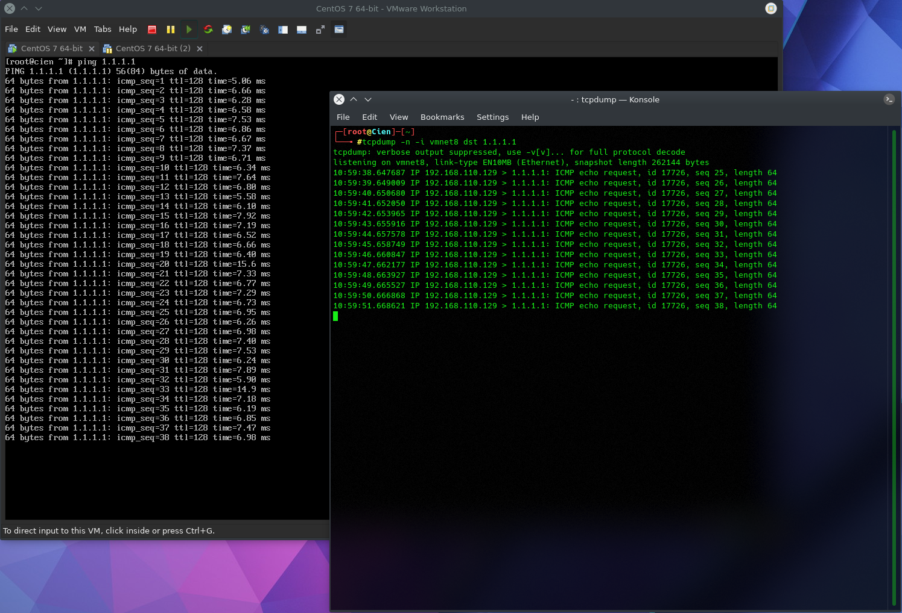
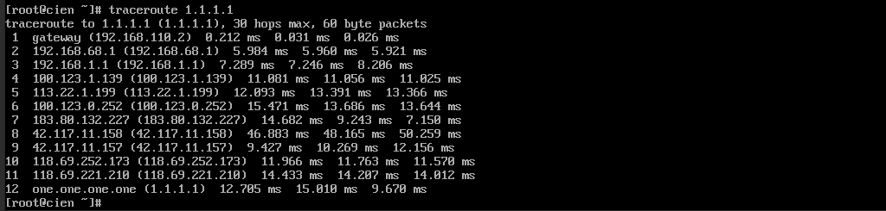

# **Report Vietnix Linux Basic**

# Part 04: 
1. <a href id='#1'> Iptables packet flow diagram
1. <a href id='#2'> Demo: Using Trace follow packages
1. <a href id='#3'> Read Iptables Rules Basic to debug 
1. <a href id='#4'> tcpdump tools and options to debug network

<div id='1'></div>

## 1. Iptables packet flow diagram

- **What is iptables ?** is a firewall application available on Linux, allows users to set access rights to selectively control traffic on the server. When using the server, the firewall is one of the important tools to help you prevent invalid access.

## Flow Diagram:


## iptables architecture

#### Tables:
Again, different tables are responsible for different tasks. The list contains:
- **filter**: This is the table most used on a daily basis. In this table you would decide whether a packet is allowed in/out your computer.
- **nat**: This table is the second most popular table and is responsible for creating new connection.
- **mangle**: allow editting the header of the packet, value of TTL, MTU, Type of Service fields.
- **raw**:  will support you work with packets before the kernel starts to check the status and can remove some packages from tracking because of the performance problem of the system.  
- **security**: is responsible for securing your computer after the filter table. Which consists of SELinux.

#### Chains: 
There are 5 chains in iptables and each is responsible for a specific task. These chains are:
- **prerouting**: in `Nat Table`, `Mangle Table` and `Raw Table`, the rules in the chain will be executed as soon as the packet into the network interface **(Network Interface)**. 
- **input**: Only in `Mangle Table` and `Nat Table` with rules are executed just before the packet meets the process. 
- **output**:  in `Raw Table`, `Mangle Table` and `Filter Table`, with rules that are executed after the packet is created. 
- **forward**: in `Mangle Table` and `Filter Table`, have rules that are executed for packets that are routed via the current host. 
- **postrouting**: in `Mangle Table` and `Nat Table` with the Rules are executed when the packet leaves the network interface. 

#### Targets: 
Target can be understood as the action for packets when the packet meets the set rules.

- **ACCEPT**: accept and allow packets to enter the system.
- **DROP**: packet type, no reply packet.
- **REJECT**: packet type but reply to other packet table. 
- **LOG**: Accepts packets but logs them. 

### How to use iptables ?
- Syntax: **iptables [-t table] command [match] [target/jump]**

**Rule commands:**
```
    -A: to append a rule to the end of the chain
    -I: to insert a rule at the specified number
    -D: to delete a rule
    -R: to replace the rule at the specific line
    -N: to create a new chain
```

**Chain commands:**
```
    -X: to delete specified chain
    -E: to rename the specified chain
    -P: to set the default policy for that chain (DROP OR ACCEPT)
```


> Example:
```
    iptables -A INPUT -s 192.168.110.131 (accept packets on IP source)
    iptables -D INPUT 2 (delete chain by line number)
```



## Path of packets: 


- Destination is IP Server: 
> Path: 
```
Packets -> mangle/PREROUTING -> nat/PREROUTING -> routing decision -> mangle/INPUT -> filter/INPUT -> local process
```
>Explain: When the packets want to be sent to server. The first chain is **Prerouting** include `Mangle and Nat tables`. This chain helps to translate the destination ip address of the packets to something that matches the routing on the local server. The **routing decision** will decide the packets can to access local server or not? To coming to the local server, packets will incoming to firewall and **INPUT chains** include `Mangle and Filter tables` will decide it.

- Server is IP Source: 
> Path: 
```
local process -> routing decision -> filter/OUTPUT -> nat/OUTPUT -> mangle/OUTPUT -> nat/POSTROUTING -> mangle/POSTROUTING
```

> Explain: The **routing decision** will send packets to OUTPUT chains. the **filter/OUTPUT** will generate packets locally and going out the local server. The **nat/OUTPUT** generate packets locally on the firewall. When OUTPUT chains is filter, the packets will sent to POSTROUTING chains. This chains helps to translate the source ip address of the packets to something that might match the routing on the desintation server.

- Destination IP is not Server: 
> Path: 
```
Packets -> mangle/PREROUTING -> nat/PREROUTING -> routing decision -> mangle/FORWARD -> filter/FORWARD -> nat/POSTROUTING -> mangle/POSTROUTING
```

>Explain: Belike the `Destination IP is Server` but in this path, the **routing decision** redirect the packets to **FORWARD chains**. The **filter/FORWARD** will routed through the local server.

<div id='2'></div>

## 2. Demo: Using Trace follow packages

- **Tcpdump**: This is a tool developed aims to analyze packets by command line. Tcmpdump allow customer to block and display packets that are to transmitted or received on the network.

#### Using tcpdump to tracking SYN packets
- Syntax: 
```
tcpdump -n -i vmnet8
OR 
tcpdump -n -i vmnet8 "tcp[tcpflags] && (tcp-syn|tcp-ack) != 0" 
```


>Explain: The `client` establish the connection with `server` by send a packet with **Flags [S](SYN packet)** then server send back to client with **Flags [S.] (SYN/ACK packet)**. Finally, after client received SYN/ACK packet, the connection established successfully. `Flags [P.]` is start to `transmit data` from client to server and server to client.

#### Tracking icmp packet from VM ping to 1.1.1.1
- Syntax: 
```
tcpdump -n -i vmnet8 
```


> Traceroute to see the packet route to IP 1.1.1.1



<div id='3'></div>

## 3. Read Iptables Rules Basic to debug 

### Allow/Deny IP access destination IP port YY 
> Syntax: 
```
#Allow
iptables -A INPUT -s <src_IP> -d <dest_IP> --dport <dest_port>  -j ACCEPT 
#Deny
iptables -A INPUT -s <src_IP> -d <dest_IP> --dport <dest_port>  -j DROP
```
### Allow/Deny new access IP to destination IP port YY 
> Syntax:
```
#Allow 
iptables -A INPUT -p tcp --syn -d <dest_IP> --dport <dest_port> -j ACCEPT
#Deny
iptables -A INPUT -p tcp -m state --state NEW -d <dest_IP> --dport <dest_port> -j ACCEPT
```

### Allow/Deny IP access to destination IP port YYY with TTL 128,64 and Length 1000
> Syntax: 
```
#Allow
iptables -A INPUT -s <src_IP> -m ttl --ttl-gt 128,64 -m --length 1000 -d <dest_IP> --dport <dest_port> -j ACCEPT
#Deny
iptables -A INPUT -s <src_IP> -m ttl --ttl-gt 128,64 --length 1000 -d <dest_IP> --dport <dest_port> -j DROP
```

### Comment iptables rules
> Syntax: 
```
iptables -m comment --comment "comment_here"
#DROP IP with comment
iptables -A INPUT -s <src_IP> -j DROP -m comment --comment "DROP IP SPAM"
#DROP port
iptables -A INPUT -p tcp --dport 80 -j DROP -m comment --comment "DROP http"
```

<div id='4'></div>

## 4. tcpdump tools and options to debug network

- **Tcpdump**: This is a tool developed aims to analyze packets by command line. Tcmpdump allow customer to block and display packets that are to transmitted or received on the network.

> Syntax: `tcpdump <-option_identifier> <option_name> <parameter> <parameter_value> <regular expressions>`

**Example:**
> List interface:  
```
tcpdump -D
```
> Capture some packets:  
```
tcpdump --interface any 
```
> Limit the number or packets:  
```
tcpdump -i any -c 5
```
> Capture and save packets in a file:  
```
tcpdump -w file_name.pcap -i any
```
> Read capture: 
```
tcpdump -r file_name.pcap
```
> Capture packet from source IP or dest IP: 
```
tcpdump -i any -s <src_ip>
tcpdump -i any -d <dest_ip>
```
> Filters with TCP flags set:  
```
tcmdump -i any "tcp[tcpflags] == tcp-syn"              #SYN flags
tcpdump -i any "tcp[tcpflags] == tcp-syn|tcp-ack"      #SYN and ACK flags
```
- Understanding the `tcpdump` Output, flags field values are: 
```
    [.] - ACK (Acknowledgment)
    [S] - SYN (Start Connection)
    [P] - PSH (Push Data)
    [F] - FIN (Finish Connection)
    [R] - RST (Reset Connection)
    [S.] - SYN-ACK (SynAcK Packet)
```

# **~~~THE END~~~**
[Back to training task](https://github.com/namluucong/Vietnix_Training/blob/main/README.md)